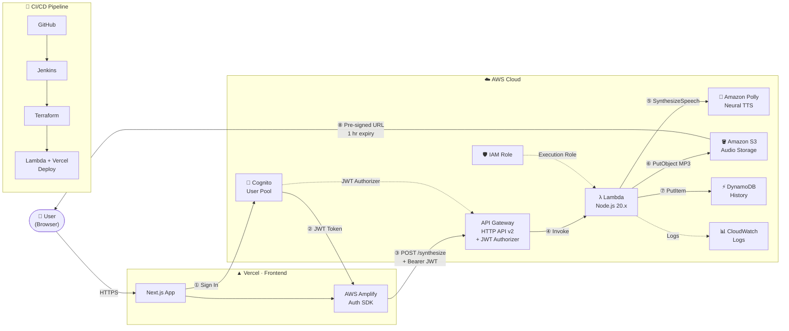

# VerbaSonare

> Serverless text-to-speech web app — type text, get a playable MP3 back in seconds.

[](https://aws.amazon.com/lambda/)
[](https://aws.amazon.com/polly/)
[](https://aws.amazon.com/s3/)
[](https://aws.amazon.com/dynamodb/)
[](https://aws.amazon.com/api-gateway/)
[](https://aws.amazon.com/cognito/)
[](https://nextjs.org/)
[](https://www.terraform.io/)
[](https://vercel.com/)
[](https://www.jenkins.io/)

---

## Architecture

> 📐 **[Open Interactive Diagram](docs/diagrams/architecture.drawio)** — click to render directly on GitHub, or open in [diagrams.net](https://app.diagrams.net) for full interactivity. Export as PNG/SVG for portfolio and LinkedIn use.

The diagram covers the complete end-to-end flow across five zones: **Client → Vercel Frontend → AWS Cloud** (Authentication, API Layer, Compute, AI/ML, Storage) → **CI/CD Pipeline**. All services use their official AWS icons with brand colours.



### Request Flow

| # | Step | Detail |
|---|------|--------|
| ① | Sign In | Custom auth page calls Amplify `signIn()` with email + password (Cognito SRP) |
| ② | JWT Token | Cognito returns ID + Access + Refresh tokens; Amplify stores them in sessionStorage |
| ③ | API Request | Amplify attaches `Authorization: Bearer <JWT>` to every API call |
| ④ | Invoke | API Gateway validates the JWT via built-in Cognito JWT Authorizer, then invokes Lambda |
| ⑤ | Synthesize | Lambda calls `Polly.SynthesizeSpeech()` — Neural engine, MP3 output |
| ⑥ | Store Audio | Lambda streams audio bytes directly into a private S3 object (AES-256 encrypted) |
| ⑦ | Store Metadata | Lambda writes `{ userId, voiceId, text, createdAt, s3Key }` to DynamoDB |
| ⑧ | Stream Audio | Lambda generates a 1-hour pre-signed S3 URL; browser plays it natively |

---

## Tech Stack

| Layer | Technology |
|-------|-----------|
| **Frontend** | Next.js 14 · React 18 · TypeScript · Tailwind CSS |
| **Auth** | AWS Cognito (User Pool, SRP auth) · AWS Amplify SDK |
| **API** | API Gateway HTTP API v2 · JWT Authorizer |
| **Compute** | AWS Lambda (Node.js 20.x, 256 MB, 30 s timeout) |
| **AI / ML** | Amazon Polly (Neural TTS, 6 voices, MP3 output) |
| **Storage** | Amazon S3 (private, AES-256, CORS, pre-signed URLs) |
| **Database** | Amazon DynamoDB (PAY_PER_REQUEST, userId PK + createdAt SK) |
| **IaC** | Terraform 1.6+ (all AWS resources) |
| **Hosting** | Vercel (frontend CDN) |
| **CI/CD** | Jenkins declarative pipeline |
| **Monitoring** | Amazon CloudWatch (Lambda logs & metrics) |

---

## Repository Structure

```
project-polly/
├── backend/
│   └── lambda/
│       └── polly-handler/
│           ├── index.mjs        # Lambda handler — Polly + S3 + DynamoDB
│           └── package.json
├── docs/
│   └── diagrams/
│       └── architecture.drawio  # Interactive architecture diagram
├── frontend/
│   ├── app/
│   │   ├── components/
│   │   │   ├── AppShell.tsx     # Nav + auth guard wrapper
│   │   │   ├── AudioPlayer.tsx
│   │   │   └── AmplifyProvider.tsx
│   │   ├── auth/
│   │   │   └── page.tsx         # Sign in / Sign up / Verify page
│   │   ├── dashboard/
│   │   │   └── page.tsx         # TTS dashboard (protected)
│   │   ├── history/
│   │   │   └── page.tsx         # Synthesis history (protected)
│   │   ├── globals.css
│   │   ├── layout.tsx
│   │   └── page.tsx             # Landing page (public)
│   ├── public/
│   │   └── VerbaSonare_logo.png
│   ├── lib/
│   │   └── api.ts               # Typed API Gateway client
│   ├── .env.local.example
│   └── package.json
├── terraform/
│   ├── main.tf
│   ├── cognito.tf
│   ├── api_gateway.tf
│   ├── lambda.tf
│   ├── s3.tf
│   ├── dynamodb.tf
│   ├── iam.tf
│   ├── variables.tf
│   └── outputs.tf
├── Jenkinsfile
└── README.md
```

---

## Routes

| URL | Access | Description |
|-----|--------|-------------|
| `/` | Public | Landing page with Sign In / Sign Up |
| `/auth` | Public | Authentication page (Sign In, Sign Up, Verify) |
| `/dashboard` | Protected | Text-to-speech synthesizer |
| `/history` | Protected | Synthesis history |

Protected routes redirect unauthenticated users to `/`.

---

## Deployment

### 1 — Provision AWS Infrastructure

```bash
cd terraform
terraform init
terraform apply
```

Note the outputs — you will need them in the next step.

### 2 — Configure Frontend Environment

```bash
cp frontend/.env.local.example frontend/.env.local
```

Fill in `frontend/.env.local` using `terraform output`:

| Variable | Terraform Output |
|----------|-----------------|
| `NEXT_PUBLIC_USER_POOL_ID` | `cognito_user_pool_id` |
| `NEXT_PUBLIC_CLIENT_ID` | `cognito_client_id` |
| `NEXT_PUBLIC_COGNITO_DOMAIN` | `cognito_hosted_ui_domain` |
| `NEXT_PUBLIC_API_URL` | `api_url` |
| `NEXT_PUBLIC_APP_URL` | `https://verbasonare-rho.vercel.app` |

### 3 — Run Frontend Locally

```bash
cd frontend
npm install
npm run dev
```

### 4 — Deploy Frontend to Vercel

1. Push repo to GitHub
2. Import project at [vercel.com](https://vercel.com) → set root directory to `frontend`
3. Add all `NEXT_PUBLIC_*` env vars in Vercel project settings
4. Copy the Vercel deploy hook URL (Settings → Git → Deploy Hooks)

### 5 — Update Terraform with Vercel URL

```bash
cd terraform
terraform apply -var="frontend_url=https://verbasonare-rho.vercel.app"
```

### 6 — Configure Jenkins

Add the following credentials in Jenkins (Manage Jenkins → Credentials):

| ID | Type | Value |
|----|------|-------|
| `aws-creds` | AWS Credentials | IAM user access key + secret |
| `vercel-deploy-hook` | Secret text | Vercel deploy hook URL |

Create a Jenkins Pipeline job pointing at this repository. The `Jenkinsfile` will:
- Run `terraform plan` on every Pull Request
- Run `terraform apply` + Lambda deploy + Vercel trigger on every merge to `main`

---

## API Reference

| Method | Path | Auth | Description |
|--------|------|------|-------------|
| `POST` | `/synthesize` | Bearer JWT | Convert text → MP3, store in S3, return pre-signed URL |
| `GET` | `/history` | Bearer JWT | Fetch last 20 synthesis records from DynamoDB |

**POST `/synthesize` body:**
```json
{
  "text": "Hello, world!",
  "voiceId": "Joanna"
}
```

Available voices: `Joanna` · `Matthew` · `Salli` · `Joey` · `Amy` · `Brian`

**Response:**
```json
{
  "audioUrl": "https://s3.amazonaws.com/...",
  "itemId": "uuid"
}
```

---

## Exporting the Architecture Diagram

The diagram is optimised for a 1900 × 1080 canvas (16:9) — ideal for LinkedIn posts and GitHub repository headers.

**Steps to export:**

1. Open [`docs/diagrams/architecture.drawio`](docs/diagrams/architecture.drawio) in [diagrams.net](https://app.diagrams.net)
2. **File → Export As → PNG** — set scale to `2x` or DPI to `300` for crisp, print-quality output
3. **File → Export As → SVG** — for a lossless vector version suitable for any size
4. Use **Extras → Edit Diagram** to customise colours, labels, or layout

> **Tip:** GitHub renders `.drawio` files natively — clicking the file in the repository opens a read-only interactive view with no additional tooling required.
